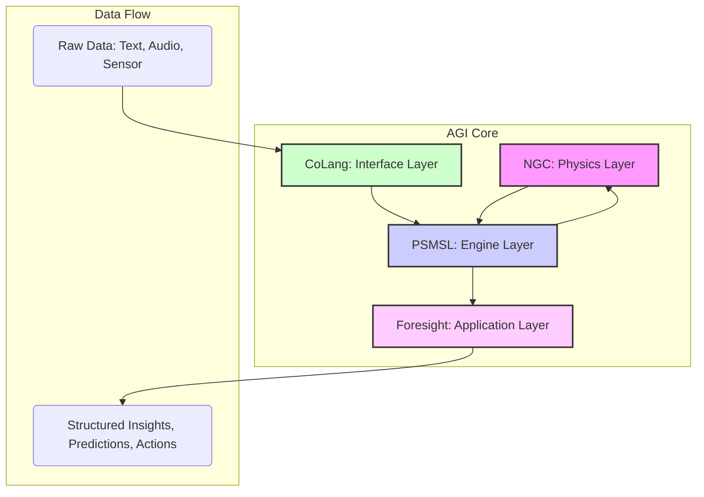

# AGI Modular Architecture: Specification v1.0

**Author:** Nathanael J. Bocker  
**Date:** January 18, 2026  
**Status:** DRAFT  
**Purpose:** To define the high-level modular architecture for a correct AGI system, outlining the components, their interfaces, and the data flow between them.

---

## 1. Guiding Principles

This architecture is designed according to the following principles:

- **Modularity:** Each component is a self-contained module with a clearly defined purpose and interface. This allows for independent development, testing, and upgrading.
- **Composability:** Modules can be combined and recombined to create different capabilities. The full AGI is the composition of all core modules.
- **Geometric Foundation:** All data structures and operations are grounded in the geometric principles of Nested Geometric Computation (NGC).
- **Relational Processing:** The system operates on the instantaneous relational structure of data, not its temporal sequence.
- **Efficiency:** The architecture is designed for memory and computational efficiency, enabling deployment on constrained hardware.

## 2. High-Level Architecture Diagram

## 3. Module Overview

This architecture consists of four primary modules, organized as a processing stack.

| Module ID | Module Name | Layer | Purpose |
| :--- | :--- | :--- | :--- |
| **M1** | **NGC (Nested Geometric Computation)** | Physics | Provides the fundamental geometric primitives, coordinate systems, and physical laws for computation. It is the "operating system" of reality. |
| **M2** | **PSMSL (φ-Scaled Mirrored Semantic Lattice)** | Engine | Implements the relational processing engine. Manages the covariance matrix, performs diagnostic calculations, and detects phase transitions. |
| **M3** | **CoLang (The Geometry of Thought)** | Interface | The human-computer interface. Translates unstructured human input (text, speech) into geometric representations for the PSMSL engine and translates geometric insights back into human-understandable forms. |
| **M4** | **Foresight (Civilizational Intelligence)** | Application | A high-level application module that uses the outputs of the PSMSL engine to analyze and predict systemic trends, risks, and opportunities across multiple temporal scales. |

## 4. Data Flow and Interfaces

### 4.1 Data Flow

1.  **Input:** Unstructured data (e.g., English text, sensor readings, economic data) is fed into the **CoLang (M3)** module.
2.  **Encoding:** **CoLang (M3)** parses the input and encodes it into a series of geometric vectors and tensors within the NGC coordinate system.
3.  **Processing:** The geometric data is passed to the **PSMSL (M2)** engine. PSMSL builds the covariance matrix, calculates the Leibniz-Bocker diagnostics (ρ, Ω, ||r||²), and detects phase transitions.
4.  **Physics Validation:** Throughout processing, **PSMSL (M2)** queries the **NGC (M1)** module to ensure all operations are consistent with the fundamental geometric laws (e.g., tetrahedral closure, φ-scaling).
5.  **Insight Generation:** The output of **PSMSL (M2)**-a stream of structured geometric insights, including coherence values, curvature, and phase transition alerts-is passed to the **Foresight (M4)** application module.
6.  **Application Logic:** **Foresight (M4)** analyzes the stream of insights to identify long-term trends, calculate the phase mismatch (Δ_mismatch), and compute the NI-ROI.
7.  **Output:** **Foresight (M4)** generates the final, human-readable output: predictions, risk assessments, and strategic recommendations.

### 4.2 Module Interfaces

Each module exposes a formal API for interaction.

-   **NGC (M1) API:**
    -   `get_coordinate_system()`: Returns parameters of the triaxial polar coordinate system.
    -   `validate_tetrahedron(vectors)`: Checks if a set of vectors forms a valid tetrahedral closure.
    -   `get_phi_scale(level)`: Returns the projection radius R_n for a given recursion level.

-   **PSMSL (M2) API:**
    -   `init_lattice(concepts)`: Initializes the covariance matrix for a set of N concepts.
    -   `update_state(vectors)`: Updates the lattice with new geometric data.
    -   `get_diagnostics()`: Returns the current (ρ, Ω, ||r||²) values.
    -   `get_phase_transition_alert()`: Returns a notification if a phase transition is detected.

-   **CoLang (M3) API:**
    -   `encode_text(text)`: Converts a string of text into a sequence of geometric vectors.
    -   `decode_insight(diagnostics)`: Converts a set of diagnostic values into a human-readable sentence.

-   **Foresight (M4) API:**
    -   `init_monitor(short_term_stream, long_term_stream)`: Initializes the phase mismatch monitor.
    -   `get_foresight_deficit()`: Returns the current Δ_mismatch value.
    -   `get_ni_roi(idea_vector)`: Calculates the National Intelligence ROI for a proposed idea.

## 5. Dependencies

-   **M2 (PSMSL)** depends on **M1 (NGC)** for its physical rules.
-   **M3 (CoLang)** depends on **M1 (NGC)** for its target coordinate system.
-   **M4 (Foresight)** depends on **M2 (PSMSL)** for its input data stream.
-   The full **AGI System** is the composition `M4(M2(M3(Input), M1))`, showing the nested dependency structure.

---

**© Nathanael J. Bocker, 2026. All rights reserved.**
